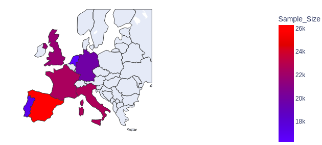
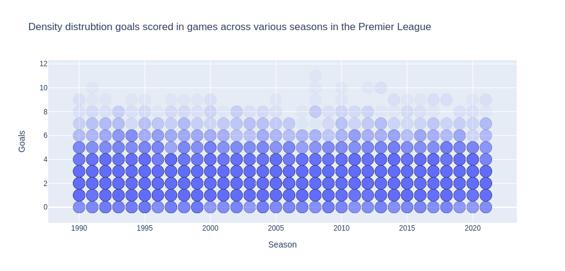
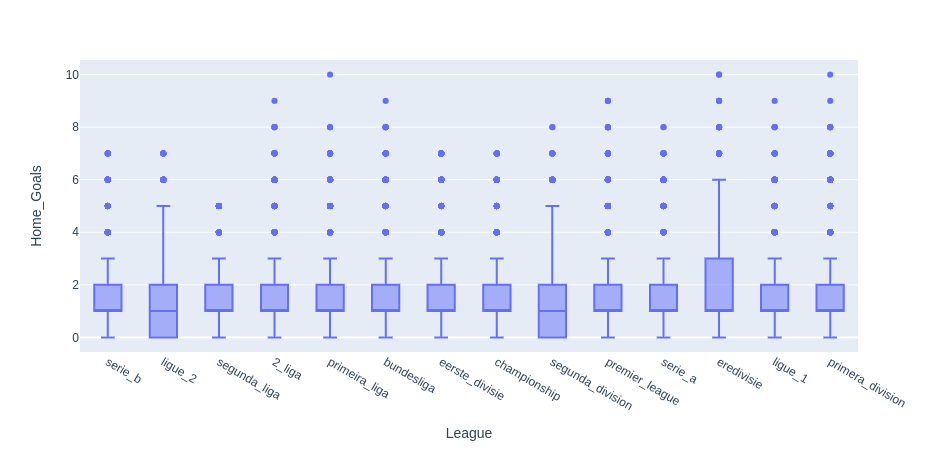

# Football Match Outcome Prediction

In this project, I'm implementing a data science pipeline seeking to predict the outcome of football matches. In addition to standard Python commands, this uses:
- The pandas and numpy libary for data wrangling and cleaning
- Levenshtein Distance textual comparisons via FuzzyWuzzy
- Exploratory data analysis and visualisation via plotly
- **to be updated as the project progress**

## Milestone 1 - EDA and Data Cleaning

- The Data Cleaning framework extracts different structured and unstructured sources of related data and validates, cleans, compares and merges it into one combined dataframe. The different data sources are csv and pickkle files containing results data, match details, ELO, and team data. These have been combined via common links on besoccer.com and team names. The end result is a dataset with ~140k entries and 18 features (noting that not all will be of use).

- Data cleaning has been carried out using standard python commands, pandas library, and fuzzywuzzy textual comparison. The notebook has been written to annotate the thought process and will later be built into a pipeline with minimal human interaction.

- Sample graphs have been plotted to better understand and visualise the data, in order to inform and determine my strategy going forward.





- It is expected that the following features will be of use going forward:
    - Result - this will need cleaning to be in a useful numerical format
    - ELO rating - this measures the relative strength of the teams at the point of the match
    - Round / Season - these are inherently linked to team ELO (e.g. if team gets stronger throughout the season, its ELO will also increase)
    - Date_New - depending on the reliability of this data, this could provide insight into correlations relating to matches played on days of the week and at different times
    - Red/Yellow cards - to be investigated as this won't be known before a match
    - Capacity - strength of crowd (noting that attendence isn't known)


- Null Hypothesis: **H<sub>0</sub>: The outcome of football natches cannot be predicted by previous statistics/records alone.**

## Milestone 2 - Feature Engineering

- The Feature Engineering code utilises the previously cleaned dataset and develops it to create new and useful features that will later go into my model. New features are created using pandas and numpy, and requires isolating, manipulating and aggregating data in various ways. The end product is clean dataset with consistent numerical data which can be loaded into my model.

- Prior to creating new features, the dataset was sorted into a time-series, by converting date strings into datetimes. This allows easier creation of typical football statistical features (e.g. winning streaks).

- The main features created revolve around the result outcome, which needed to be quantified in a code friendly format. To do this, the result string was split into two numerical features, Home Goals and Away Goals, such that a simple outcome classifier could be created: +1 for a Home Win, 0 for a Draw, -1 for an Away Win. From here, the following features could be created:
    - Home/Away Team winning streak for Home/Away/All matches
    - Home/Away Team form (i.e. aggregation of results outcome for last 5 matches) for both Home/Away/All matches
        - Calculating streaks required cumulative summations on shifted data as follows:
            ```python
            def get_streak(df, team):
                team_result_series = df['Outcome'].where(df['Home_Team'] == team, -df['Outcome'])
                team_streak_series = team_result_series.groupby((team_result_series != team_result_series.shift()).cumsum()).cumsum()
                return team_streak_series.where(team_streak_series > 0, 0) 
            ```
    - Home/Away Team goals scored for Home/Away/All matches over the rolling last 10 matches

#### *** WIP - TO BE UPDATED BEYOND THIS POINT ***


- Answer some of these questions in the next few bullet points. What have you built? What technologies have you used? Why have you used those?

- Example: The FastAPI framework allows for fast and easy construction of APIs and is combined with pydantic, which is used to assert the data types of all incoming data to allow for easier processing later on. The server is ran locally using uvicorn, a library for ASGI server implementation.

- Does what you have built in this milestone connect to the previous one? If so explain how. What technologies are used? Why have you used them? Have you run any commands in the terminal? If so insert them using backticks (To get syntax highlighting for code snippets add the language after the first backticks).

- Example below:

```bash
/bin/kafka-topics.sh --list --zookeeper 127.0.0.1:2181
```

- The above command is used to check whether the topic has been created successfully, once confirmed the API script is edited to send data to the created kafka topic. The docker container has an attached volume which allows editing of files to persist on the container. The result of this is below:

## Conclusions

- Maybe write a conclusion to the project, what you understood about it and also how you would improve it or take it further.

- Read through your documentation, do you understand everything you've written? Is everything clear and cohesive?
